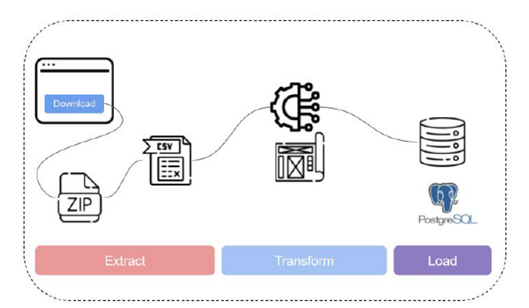

# CIP-Financial-Data-with-Python

## Situation

The goal was to start building a financial market database to support time-series, qualitative, and quantitative analysis. Every download depends on tickers, and no Python package ships with a complete list — so the first job was building a comprehensive ticker universe, then pulling prices, company profiles, sustainability data, and insider transactions from several sources with different formats.

## What I Built



An Extract → Transform → Load pipeline. Raw data is downloaded and scraped into CSV files, then cleaned, validated and merged on a shared ticker key, and finally loaded into a relational database for querying.

- Phase 1 – Ticker and reference data: scraped S&P 500 members from Wikipedia, ticker lists from EODData, and profile and sustainability data plus crypto tickers from Yahoo Finance. Joined everything into one file, validated tickers and missing data, and extracted a second list of the 500 highest-volume non-S&P 500 tickers
- Phase 2 – Market data: downloaded time series for both ticker lists and a market benchmark through the yfinance module, checked for missing data, outliers and irregularities, excluded low-volume tickers, then merged the results with the sustainability and profile data
- Phase 3 – Insider transactions: scraped SEC EDGAR filings for the top-ranked tickers with Selenium and BeautifulSoup, reshaped them so they join on ticker, checked for gaps, and added an insider sum column
- Load: combined the outputs of all three phases and uploaded them to MariaDB, where sorting, ranking, and group-by queries answer the analysis questions


## Impact
- Solved the missing-ticker problem by building a ticker universe from scratch, since no Python package provides one — every later download depended on it
- Built validation into each phase (validity, missing values, outliers, irregularities, low-volume exclusions) before anything was merged, so the database wasn't built on unchecked data
- Designed each phase's output to join on a shared ticker key, so prices, profile and sustainability data, and insider transactions could be combined into one MariaDB database and queried to answer a defined set of analysis questions.

**What the data showed (2020-12-31 to 2021-10-29):**

- **[Q1](assets/question%201.png) – Insider buying in top-ESG tech stocks:** the 5 best-ESG-ranked S&P 500 IT stocks that beat the sector average were KEYS, CDW, HPQ, ACN and STX, up 23–43%. The largest net insider buyers were Christoph Schell (HPQ, +84,346 shares), Marie Myers (HPQ, +25,138) and Jeffrey D. Nygaard (STX, +14,451).
- **[Q2](assets/question%202.png) – Insiders in the best performers:** the top 5 S&P 500 stocks were MRNA (+230%), DVN (+154%), MRO (+145%), BBWI (+130%) and FTNT (+126%). The largest net buyers were Dane E. Whitehead (MRO, +66,803), Lee M. Tillman (MRO, +65,782) and David Gerard Harris (DVN, +47,927). The largest net sellers were Felix Investments Holdings II (DVN, −29.6M shares), Noubar Afeyan (MRNA, −10.3M) and Stéphane Bancel (MRNA, −1.07M), so Moderna insiders sold heavily into its rally.
- **[Q3](assets/question%203.png) – Trading volume:** S&P 500 members averaged about 607M shares traded, against 218M for the 500 most-active non-members. That is roughly 2.8× the volume.
- **[Q4](assets/question%204.png) – ESG vs. the market:** 16 of the 20 best-ESG-ranked stocks (80%) beat the SPY benchmark's 22.8% return.


## Dataset Description

**Extracted in this repo:**
- **Yahoo Finance** (via [`yfinance`](https://github.com/ranaroussi/yfinance)): daily OHLCV data from `2020-12-31` to `2021-10-29` for about 500 S&P 500 members, about 500 non-members, and the `SPY` ETF.

**Provided by teammates:**
- **1st source**: S&P 500 tickers with `Sector` / `Sub-Industry`, ESG fields (`ESG Score`, `ENVRisk`, `SocialRisk`, `GovRisk`), and the 500 most-active non-S&P-500 tickers by volume.
- **2nd source**: insider transactions per person/company/ticker from SEC/EDGAR. `A` is shares acquired, `D` is shares disposed, and `Difference = A - D` (a positive value means a net buyer).

The working datasets are not committed. The notebooks read and write them in a sibling `../Data/` directory. The repo-root `Data/` folder holds only the two ticker reference lists (`tickers_sp500_stage.csv`, `non_members_stage.csv`).

## Tech Stack

**Language:** Python, Selenium, BeautifulSoup

**Libraries:** pandas, numpy, yfinance, matplotlib, missingno, pymysql, SQLAlchemy

**Database:** MariaDB / MySQL

## Setup / How to Run

Install dependencies:

```bash
pip install pandas numpy yfinance matplotlib missingno pymysql sqlalchemy jupyter
```

Fill a sibling `../Data/` directory with the input files from  Source 1, start a local MariaDB/MySQL server, then run the notebooks in this order:

```bash
jupyter notebook Code/Tran_Dao_StudC_extract_code.ipynb
```

```bash
jupyter notebook Code/Tran_Dao_StudC_transform_code.ipynb
```

```bash
jupyter notebook Code/Tran_Dao_StudC_Question_01.ipynb
jupyter notebook Code/Tran_Dao_StudC_Question_02.ipynb
jupyter notebook Code/Tran_Dao_StudC_Question_03.ipynb
jupyter notebook Code/Tran_Dao_StudC_Question_04.ipynb
```

```bash
jupyter notebook Code/Tran_Dao_StudC_createDB_mariaDB.ipynb
jupyter notebook Code/Tran_Dao_StudC_loadData_mariaDB.ipynb
```

## Key Learning Takeaways

- Ran a full data-cleaning workflow: missing values, duplicates, outlier detection with box plots, dtype and date-range checks, and fixing inconsistent values.
- Handled a real cross-team data handoff: sending ticker shortlists to a teammate and merging their scraped results back into the analysis.
- Wrote pandas DataFrames to a relational database (MariaDB) with SQLAlchemy and checked the load with `SHOW TABLES` and `read_sql`.
